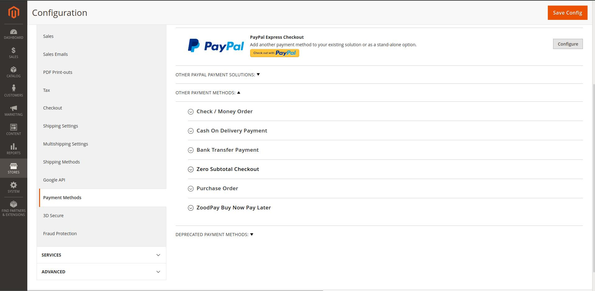

# ZoodPay Magento 2 Payment Module
[](LICENSE.md)

ZoodPay Buy Now Pay Later payment Module for the Magento 2.

[ZoodPay API Documentation](https://apidocs.zoodpay.com/)

## Installation

```shell
# 1. Copy The Content of this archive to /app/code/OrientSwiss/ZoodPay

# 2. We will enable the module with help of Magento CLI (command-line interface)
$ bin/magento module:enable OrientSwiss_ZoodPay
## Expected response: Module is enabled

# 3. Setup Upgrade with help of Magento CLI (command-line interface)
$ bin/magento setup:upgrade

# 4. Dependencies Injection Compile with help of Magento CLI (command-line interface)
$ bin/magento setup:di:compile
# Expected response: Generated code and dependency injection configuration successfully.

# 5. Static Content deployment with help of Magento CLI (command-line interface)
$ bin/magento setup:static-content:deploy
## Expected response: Successful: XXXXXXX files; errors: 0.
```
## Usage

```
1. Log in to Magento Admin and navigate to System > Cache Management
2. Flush the cache storage by selecting Flush Cache Storage
3. In the Magento admin site, navigate to Stores > Configuration > Sales > Payment Methods and verify that ZoodPay Buy Now Pay Later is Displayed
```


## Changelog
Please see [CHANGELOG](CHANGELOG.md) for more information what has changed recently.

## Contributing
Please see [CONTRIBUTING](CONTRIBUTING.md) for details.

##Support 
For any inquiry write to integration@zoodpay.com with a detailed description of the issue.
## Credits
- [ZoodPay](https://github.com/orientswiss)
## License
The AFL License v.3.0 (AFL). Please see [License File](LICENSE.md) for more information.
